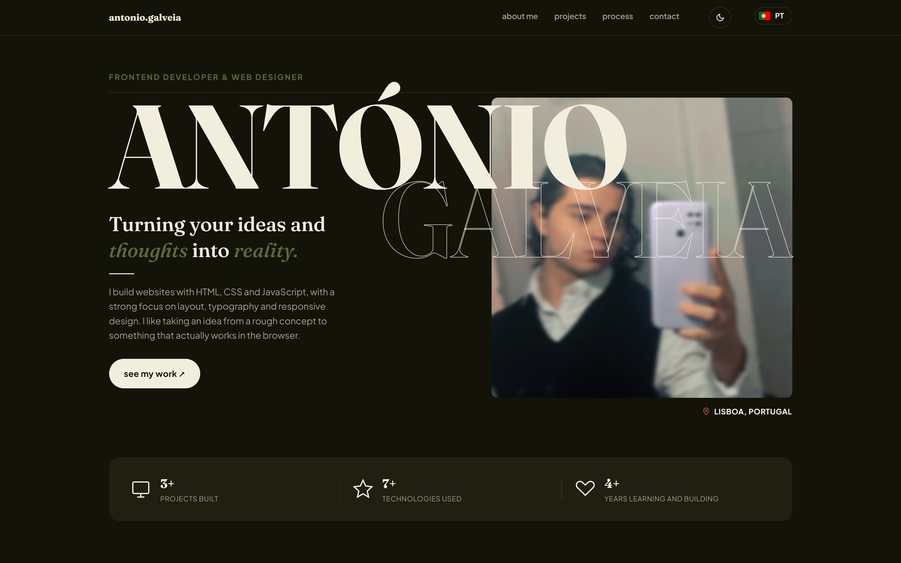
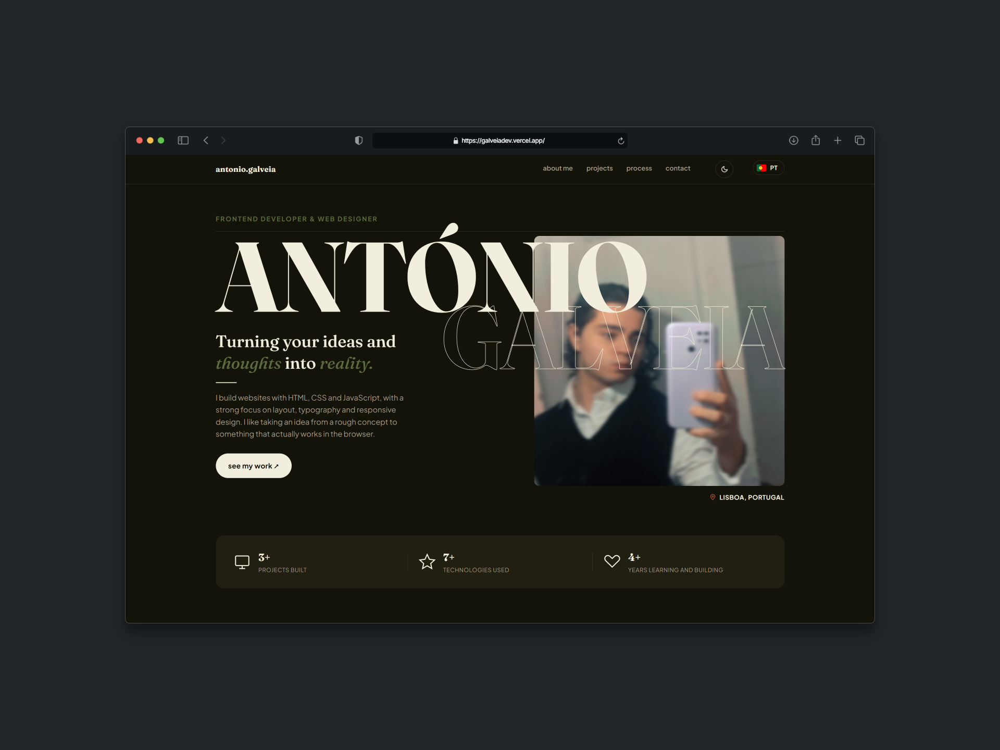
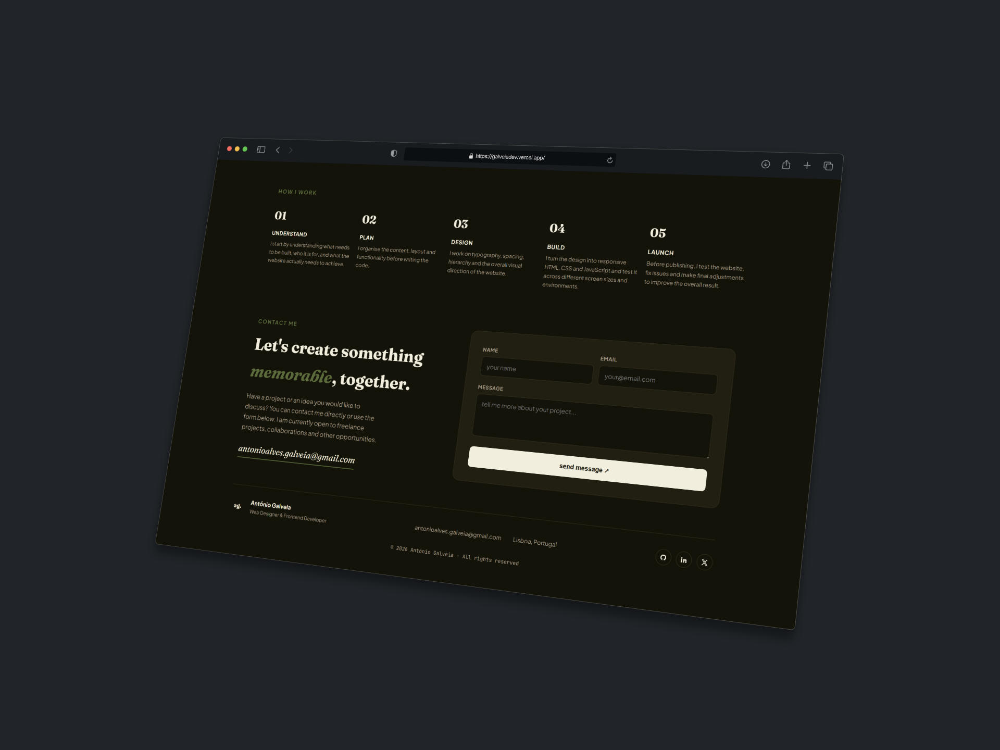
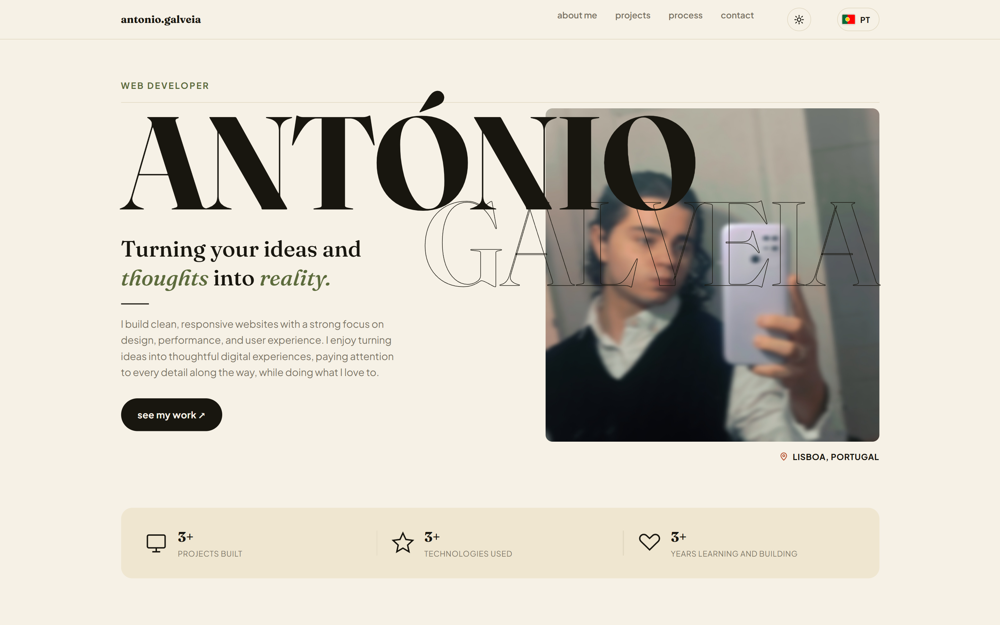
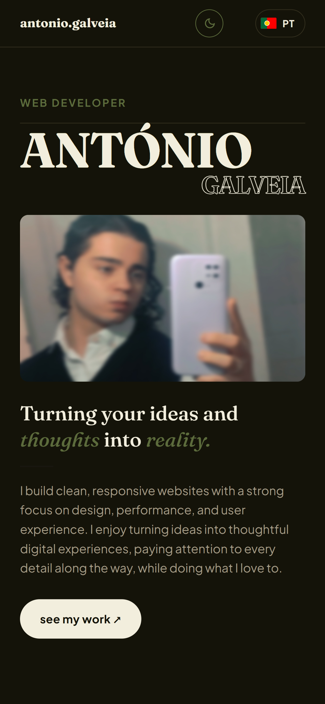
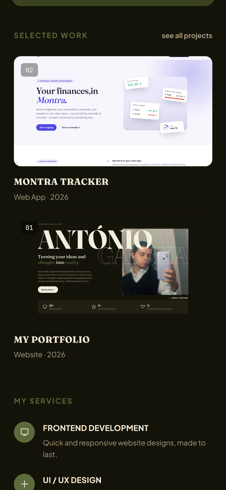

# 👋 Galveia Dev — Personal Portfolio

> 💻 My personal portfolio built from scratch to present my work, skills and the way I approach web development.



---

## 🧭 About the project

This is my personal web development portfolio.

I built it as more than just a place to list projects. I wanted it to feel like **my own space on the web** - something that represents how I work, what I am interested in and the kind of websites I want to build.

Instead of starting from a template, I researched some other portfolios I liked and built this one from scratch using **HTML, CSS and JavaScript**.

Most of the visual decisions came from experimenting with layouts, typography, spacing and colour until the website started to feel coherent.

The design is intentionally **editorial, slightly vintage-inspired and personal**. I wanted something different from the usual developer portfolio — less like a technical dashboard and more like a small publication about the person behind the code.

---

## 💭 The idea behind it

When I started working on this portfolio, I wanted to avoid making a website that simply said:

> *"Here are my skills. Here are my projects. Hire me."*

A portfolio should show some of the person's **thinking** as well.

So I tried to make the website answer a few simple questions:

* Who am I?
* What do I build?
* How do I approach a project?
* What have I actually made?
* What am I still learning?
* How can someone get in touch with me?

This also influenced the structure of the website.

The **About** section is deliberately personal, while the **Services** and **Work** sections are more practical. The process section explains how I normally think about a project, from understanding the problem to publishing the final result.

The goal was to keep the website useful without making it feel overly corporate.

---

## 📖 A small history of the project

The portfolio started as a simple experiment: **I needed a website for myself.**

At first, the main goal was simply to have somewhere to show my projects. As I kept developing it, however, the project became an opportunity to experiment with things I wanted to understand better:

* 📱 Responsive layouts
* 🎨 CSS variables and themes
* ✒️ Typography
* ⚙️ JavaScript interactions
* ♿ Accessibility
* 📩 Form handling
* 🖼️ Image galleries
* 🌍 Language switching
* 💾 Local storage
* ✨ UI details and micro-interactions

The website changed quite a lot during development.

Some sections were redesigned, some ideas were removed, and some pieces of CSS stayed around while I figured out a better solution.

That process is part of the reason I prefer this project over using a ready-made template.

It is still a work in progress — and that's intentional.

> 🌱 A portfolio should change as the person behind it changes.

---

## 🖼️ Screenshots

### 🖥️ Desktop





### ☀️ Light mode



### 📱 Mobile




---

## ✨ Features

* 📱 Responsive design
* ☀️ Light mode & 🌙 dark mode
* 🇬🇧 English / 🇵🇹 Portuguese language switcher
* 💼 Interactive project cards
* 🖼️ Project image galleries
* ⌨️ Keyboard navigation
* 🔐 Accessible modal states
* ✉️ Contact form
* ✅ Client-side form validation
* 💾 Local storage for theme and language preferences
* ♿ Accessibility considerations
* 🚫 No frontend framework

---

## 🎨 Design

The visual identity of the portfolio is based around an **editorial aesthetic** rather than the typical developer landing page.

The typography combines:

* ✒️ **Fraunces** — headings and expressive elements
* 🔤 **Plus Jakarta Sans** — interface text
* 💻 **JetBrains Mono** — technical details

The colour palette uses warm neutrals together with olive, burnt and mustard tones.

I wanted the result to feel slightly vintage without making the website look like a recreation of an old website.

The ☀️ light mode follows the same idea rather than simply inverting the colours.

---

## ♿ Accessibility

Accessibility was considered during development rather than added as an afterthought.

Some of the things implemented include:

* 🧱 Semantic HTML structure
* ⌨️ Keyboard-accessible project cards
* 🎯 Focus states
* 🏷️ ARIA attributes for the project modal
* ⬅️➡️ Keyboard controls for image galleries
* 📝 Accessible form behaviour
* 🌍 Document language information
* 📱 Responsive layouts

There is still room for improvement, but accessibility is something I want to keep improving as the project evolves.

---

## 🧠 What I learned

This project taught me that building a website **for yourself can actually be harder than building one for someone else**.

When you are working for a client, there is usually a clear target. With a personal portfolio, almost every decision becomes a question:

> **"Does this actually represent me?"**

I also learned that small details have a surprisingly large impact.

Typography, spacing, button states, transitions, image proportions and even the way a sentence is written can completely change how a website feels.

More importantly, the project gave me a place to experiment without being afraid of changing things later.

That is probably the most important part of the project for me.

---

## 📂 Project structure

```text
/
├── src/
│   ├── media/
│   │   └── /*screenshots*/
│   │
│   ├── index.html
│   ├── style.css
│   └── index.js
├── README.md
├── robots.txt
└── sitemap.xml
```

---

## 🌐 Live version

The current version of the portfolio is available here:

### 👉 [galveiadev.vercel.app](https://galveiadev.vercel.app)

---
## 🔨 Status

🟢 **Active development**

The portfolio is a living project.

I will continue adding projects, improving existing sections and experimenting with new ideas as I develop my skills.

---

## 📄 License

This project is a personal portfolio.

The source code is available for viewing and learning purposes, but the content, images, branding and personal information should not be reused as someone else's portfolio.

---

<p align="center">
  Made with ☕, curiosity and a lot of CSS.
</p>
